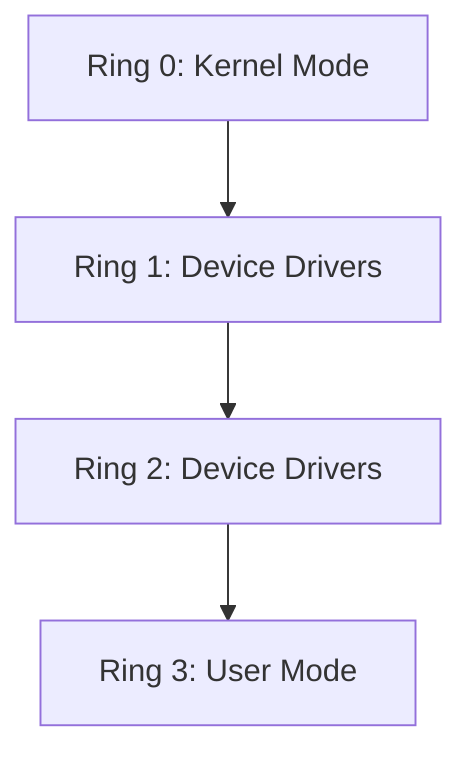

import { Callout, Steps, Step } from "nextra-theme-docs";

# CPU Features

The central processing unit (CPU) is the brain of a computer system, responsible for executing instructions and performing calculations. Modern CPUs come with a variety of features that enhance their performance and functionality. In this section, we will explore some of the key features of CPUs and how they contribute to the overall performance of an operating system.

## Multi-Programming Support

One of the essential features of a CPU that supports multi-programming is the ability to switch between different processes quickly. This is achieved through a combination of hardware and software mechanisms, such as:

- **Interrupt Mechanism**: The CPU should have an interrupt mechanism that allows it to preempt running processes and handle events or service requests from I/O devices or other processes. This ensures that the system remains responsive and can handle multiple tasks simultaneously.

- **Clock**: A clock is necessary to keep track of the time a process has been running and to facilitate context switching between processes at regular intervals.

- **CPU Protection Levels**: The CPU should have at least two protection levels (user mode and kernel mode) to restrict access to certain instructions and prevent processes from interfering with each other or the operating system.

<Callout type="info">
To learn more about how these features enable multi-programming, check out the [Interrupt Handling](/interrupts-and-interrupt-handling/interrupt-handling) and [Kernel Architectures](/cpu-features-and-kernel-architectures/kernel-architectures) sections.
</Callout>

## CPU Privilege Modes

Most CPUs have at least two privilege modes: user mode and kernel mode (also known as supervisor mode). These modes determine the level of access a process has to system resources and instructions.

- **User Mode**: In user mode, processes have limited access to system resources and cannot execute privileged instructions. This helps maintain system stability and security by preventing processes from interfering with each other or the operating system.

- **Kernel Mode**: When executing in kernel mode, the CPU has unrestricted access to all system resources and can execute privileged instructions. The operating system kernel runs in this mode to manage system resources and provide services to user processes.

Some CPUs, like the Intel x86 family, have additional privilege modes called protection rings. These rings provide a more fine-grained control over access to system resources.

## Virtualization Extensions

Modern CPUs often include virtualization extensions that allow multiple operating systems to run simultaneously on the same hardware. These extensions provide hardware support for virtualization, enabling more efficient and secure virtual machine management.

Examples of virtualization extensions include:

- Intel VT-x (Intel Virtualization Technology)
- AMD-V (AMD Virtualization)

These extensions introduce an additional privilege level below Ring 0, sometimes referred to as "Ring -1," which allows hypervisors to manage multiple operating systems efficiently.

<Steps>
### Step 1
The hypervisor, running in Ring -1, creates virtual machines (VMs) and assigns resources to each VM.

### Step 2
Each VM runs its own operating system, which believes it has full control over the hardware resources assigned to it.

### Step 3
When a VM attempts to execute a privileged instruction or access hardware resources, the CPU traps these requests and forwards them to the hypervisor.

### Step 4
The hypervisor emulates the requested operation or provides mediated access to the hardware resource, ensuring isolation and security among the VMs.
</Steps>

To learn more about how virtualization extensions support multiple operating systems, visit the [Virtual Memory](/virtual-memory-and-object-oriented-design/virtual-memory) section.

## Conclusion

CPU features play a crucial role in enabling operating systems to efficiently manage system resources and provide a stable, secure, and responsive environment for user processes. By understanding these features, software engineers and system administrators can develop and maintain operating systems that leverage the full potential of modern CPUs.