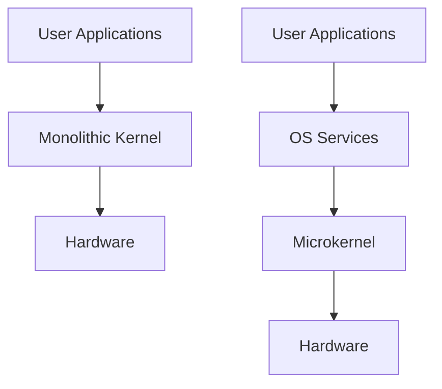

import { Callout, Steps, Step } from "nextra-theme-docs";

# Kernel Architectures

The kernel is the core component of an operating system, responsible for managing system resources, providing an interface between hardware and software, and ensuring the smooth operation of the entire system. In this section, we will explore the different architectures of the operating system kernel and their implications on system performance, security, and modularity.

## Monolithic Kernels

A monolithic kernel is a single, large program that contains all the necessary components of the operating system, including device drivers, file systems, and memory management. This architecture is known for its simplicity and performance, as all the components are tightly integrated and can communicate efficiently.

<Callout type="info">
The Linux kernel is a prime example of a monolithic kernel, although it has been modularized to some extent over the years.
</Callout>

However, monolithic kernels have some drawbacks:

- They are more vulnerable to security threats, as a single bug in any component can compromise the entire system.
- They are less modular, making it harder to update or replace individual components without affecting the entire kernel.
- They are more difficult to maintain and debug, as the codebase is large and complex.

## Microkernel Architecture

In contrast to monolithic kernels, microkernels aim to minimize the amount of code running in privileged mode by moving most of the operating system services into user-space processes. The kernel itself only provides the most essential functions, such as inter-process communication (IPC), memory management, and scheduling.

Here's a simple diagram illustrating the difference between monolithic and microkernel architectures:

Microkernels offer several advantages:

- They are more secure, as a bug in one service is less likely to affect the entire system.
- They are more modular, allowing for easier updates and replacements of individual components.
- They are easier to maintain and debug, as the codebase is smaller and more focused.

However, microkernels also have some drawbacks:

- They may have lower performance compared to monolithic kernels, due to the increased overhead of IPC between user-space services and the kernel.
- They are more complex to design and implement, as the interactions between components must be carefully planned and optimized.

Some notable examples of microkernel-based operating systems include:

- QNX
- L4 family (seL4, Fiasco.OC, L4Re)
- Mach (used as the basis for GNU Hurd and Mac OS X)

## Hybrid Kernels

Hybrid kernels attempt to combine the best aspects of monolithic and microkernel architectures by running some services in user-space while keeping others in the kernel space. This approach allows for a balance between performance and modularity, as critical services can be kept in the kernel for efficiency, while less essential components can be moved to user-space for flexibility.

The Windows NT kernel is a well-known example of a hybrid kernel, as it runs some device drivers and services in user-space while keeping the core components in the kernel.

## Exokernels and Unikernels

In recent years, two new kernel architectures have gained attention: exokernels and unikernels.

Exokernels aim to provide a minimal abstraction layer over the hardware, allowing user-space applications to have more direct control over system resources. This approach can lead to better performance and flexibility, as applications can optimize their resource usage based on their specific needs.

Unikernels, on the other hand, are specialized, single-address-space kernels that are compiled together with the application they are intended to run. This results in a highly optimized and secure system, as the kernel is tailored to the specific requirements of the application.

<Callout type="warning">
Exokernels and unikernels are still largely experimental and have not seen widespread adoption in production environments.
</Callout>

## Choosing the Right Kernel Architecture

When designing an operating system, the choice of kernel architecture depends on various factors, such as:

- Performance requirements
- Security considerations
- Modularity and maintainability
- Hardware constraints
- Intended use case (e.g., embedded systems, servers, desktops)

In practice, most modern operating systems use a hybrid approach, incorporating elements of both monolithic and microkernel architectures to strike a balance between performance, security, and modularity.

For a more detailed discussion on the pros and cons of different kernel architectures, refer to the [Operating System Concepts](https://www.os-book.com/) book by Abraham Silberschatz, Peter B. Galvin, and Greg Gagne.

<Steps>
### Step 1

Understand the differences between monolithic, microkernel, and hybrid architectures.

### Step 2

Consider the specific requirements of your operating system, such as performance, security, and modularity.

### Step 3

Choose the kernel architecture that best fits your needs, or consider a hybrid approach that combines elements of different architectures.

### Step 4

Implement and test your kernel, paying attention to the interactions between components and the overall system performance.
</Steps>

By carefully evaluating the trade-offs between different kernel architectures and selecting the most appropriate one for your operating system, you can create a robust, efficient, and secure foundation for your system.