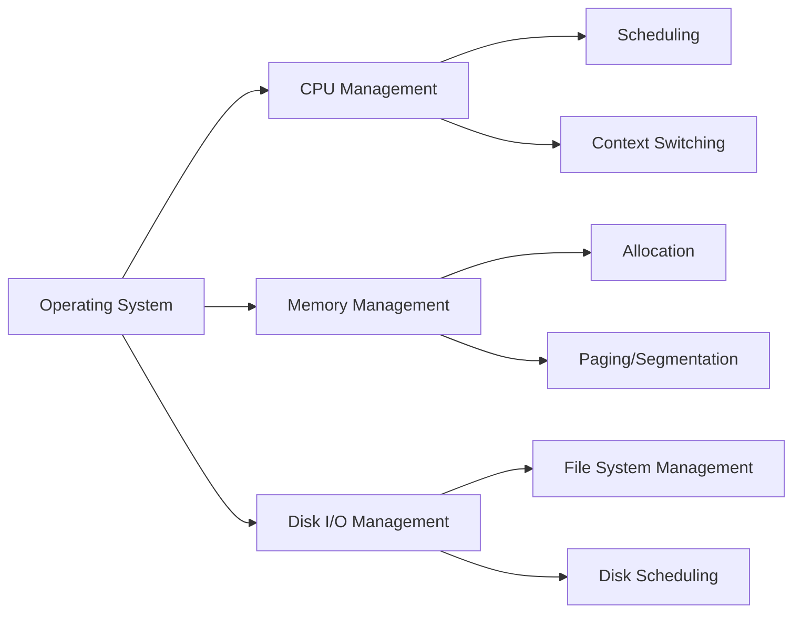

import { Callout, Steps, Step } from "nextra-theme-docs";

# Hardware Resources

The operating system is responsible for managing the hardware resources of a computer system. These resources include the central processing unit (CPU), memory, and disk input/output (I/O) devices. Understanding how the operating system interacts with these hardware components is crucial for developers, system administrators, and IT professionals.

In this section, we will explore the three main hardware resources managed by the operating system:

1. [CPU](/hardware-resources/cpu): The CPU is the brain of the computer, executing instructions and performing calculations. We will discuss how the operating system schedules tasks on the CPU and manages its usage.

2. [Memory](/hardware-resources/memory): Memory is the temporary storage space used by the operating system and running applications. We will examine how the operating system allocates and manages memory, ensuring efficient utilization and preventing conflicts between processes.

3. [Disk Input & Output](/hardware-resources/disk-input-output): Disk I/O refers to the reading from and writing to persistent storage devices, such as hard drives and solid-state drives (SSDs). We will investigate how the operating system optimizes disk I/O operations and manages file systems.

<Callout type="info">
The operating system acts as a mediator between the hardware resources and the software applications, abstracting the complexities of the underlying hardware and providing a consistent interface for applications to interact with the system.
</Callout>

By efficiently managing hardware resources, the operating system ensures optimal system performance, stability, and responsiveness. It achieves this through various techniques, such as:

- CPU scheduling algorithms
- Memory management strategies (e.g., paging, segmentation)
- Disk I/O scheduling and caching mechanisms

Here's a high-level overview of how the operating system interacts with hardware resources:

The operating system's role in managing hardware resources can be summarized using the following equation:

$\text{System Performance} = \frac{\text{Efficient Resource Management}}{\text{Hardware Constraints}}$

By diving deeper into each hardware resource category, you will gain a comprehensive understanding of how the operating system optimizes the utilization of the CPU, memory, and disk I/O devices, ultimately leading to better system performance and stability.