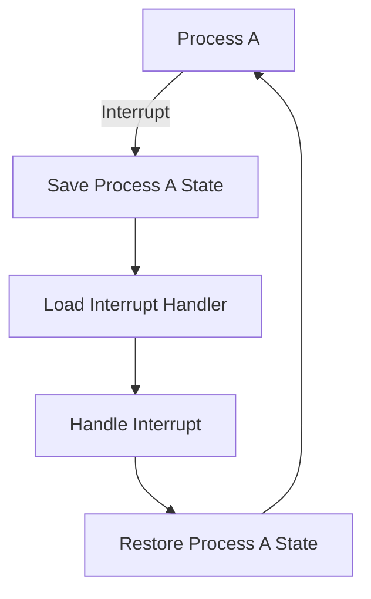

import { Callout, Steps, Step } from "nextra-theme-docs";

# CPU

The Central Processing Unit (CPU) is the brain of your computer, responsible for executing instructions and performing calculations. In this section, we'll dive into the role of the CPU in the operating system and explore its key features.

## CPU Basics

At its core, the CPU is made up of several components:

- **Arithmetic Logic Unit (ALU)**: Performs mathematical and logical operations
- **Control Unit**: Manages the flow of instructions and data within the CPU
- **Registers**: Small, fast storage locations within the CPU for holding data and instructions
- **Cache**: High-speed memory that stores frequently accessed data and instructions

<Callout type="info">
The CPU's clock speed, measured in Hertz (Hz), determines how many instructions it can process per second. A higher clock speed generally means faster performance.
</Callout>

## CPU Scheduling

One of the primary tasks of the operating system is to manage the CPU's time and resources efficiently. This is where CPU scheduling comes into play. The OS uses various algorithms to determine which processes should be allocated CPU time and in what order.

Some common CPU scheduling algorithms include:

- First-Come, First-Served (FCFS)
- Shortest Job Next (SJN)
- Priority Scheduling
- Round Robin (RR)

<Steps>
### Step 1

The OS maintains a ready queue of processes waiting to be executed.

### Step 2

The CPU scheduler selects a process from the ready queue based on the chosen algorithm.

### Step 3

The selected process is allocated CPU time and begins execution.

### Step 4

When the process completes or its allocated time slice expires, the OS performs a context switch, saving the process's state and loading the next process.
</Steps>

## Interrupts and Context Switching

Interrupts play a crucial role in the CPU's interaction with the operating system. When an interrupt occurs, the CPU temporarily stops executing the current process and switches to a special interrupt handler routine.

Common types of interrupts include:

- Hardware interrupts (e.g., timer, I/O device)
- Software interrupts (e.g., system calls, exceptions)

When an interrupt is triggered, the OS performs a context switch, saving the current process's state and loading the interrupt handler. After the interrupt is handled, the OS restores the previous process's state, and the CPU resumes execution.

## CPU Protection Rings

To ensure system stability and security, modern CPUs implement protection rings, which define different levels of access and privileges for executing code. The most common protection ring model is the hierarchical ring model, with Ring 0 being the most privileged and Ring 3 the least privileged.

- **Ring 0**: Kernel mode, full access to hardware and memory
- **Ring 1-2**: Used for device drivers and system services
- **Ring 3**: User mode, limited access to hardware and memory

<Callout type="warning">
Code executing in lower-numbered rings has more privileges and can access resources in higher-numbered rings, but not vice versa. This helps prevent unauthorized access and maintains system stability.
</Callout>

## Conclusion

The CPU is a critical component of the operating system, responsible for executing instructions and managing processes. By understanding the role of the CPU, including scheduling, interrupts, context switching, and protection rings, you'll have a stronger foundation for exploring other aspects of the OS, such as [memory management](/memory), [process management](/processes), and [I/O operations](/disk-input-output).