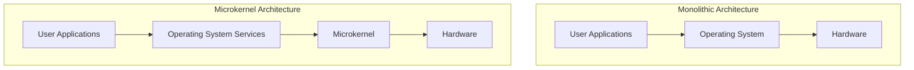

import { Callout, Steps, Step } from "nextra-theme-docs";

# Overview of Operating Systems

An operating system (OS) is a critical piece of software that manages computer hardware, software resources, and provides common services for computer programs. It acts as an intermediary between the computer's hardware and the user, providing a platform for applications to run on.

The main functions of an operating system include:

<Steps>
### Resource Management
The OS manages the computer's resources, such as the [CPU](/hardware-resources/cpu), [memory](/hardware-resources/memory), and [disk I/O](/hardware-resources/disk-input-output), allocating them to different processes and ensuring optimal utilization.

### Process Management
The OS is responsible for creating, scheduling, and terminating processes. It ensures that processes have access to the necessary resources and that they do not interfere with each other.

### Memory Management
The OS manages the computer's memory, allocating it to different processes and ensuring that each process has access to the memory it needs. It also implements [virtual memory](/memory-resources-and-paging/paging) techniques to provide processes with more memory than is physically available.

### File System Management
The OS provides a file system that allows users to store and retrieve data from storage devices. It also manages access to files, ensuring that only authorized users can access them.

### User Interface
The OS provides a user interface, which can be either a command-line interface (CLI) or a graphical user interface (GUI), allowing users to interact with the computer.
</Steps>

## Types of Operating Systems

There are several types of operating systems, each designed for specific purposes:

- **Batch Operating System**: Processes jobs in batches, without user interaction.
- **Time-sharing Operating System**: Allows multiple users to share the computer's resources simultaneously.
- **Distributed Operating System**: Manages a group of independent computers, making them appear as a single computer to the user.
- **Network Operating System**: Provides features and services to support a network of computers.
- **Real-time Operating System**: Designed to process real-time data with minimal latency.

<Callout type="info">
The most common types of operating systems used today are **desktop operating systems** (e.g., Microsoft Windows, macOS, Linux) and **mobile operating systems** (e.g., Android, iOS).
</Callout>

## Operating System Architecture

The architecture of an operating system refers to the way its components are organized and how they interact with each other. The two main architectures are:

- **Monolithic Architecture**: All OS components are tightly coupled and run in a single address space, providing high performance but lower stability and security.
- **Microkernel Architecture**: The OS is divided into small, modular components that communicate through message passing, providing better stability and security but lower performance.

The choice of architecture depends on the specific requirements of the system, such as performance, security, and maintainability.

## Conclusion

Understanding the fundamentals of operating systems is essential for anyone working with computers, whether as a [software engineer](/audience), [system administrator](/audience), or [IT professional](/audience). By managing the computer's resources and providing a platform for applications to run on, operating systems play a critical role in modern computing.

To learn more about the specific components and functions of operating systems, see the following sections:

- [Hardware Resources](/hardware-resources)
- [Development Cycles and Requirements Analysis](/development-cycles-and-requirements-analysis)
- [CPU Features and Kernel Architectures](/cpu-features-and-kernel-architectures)