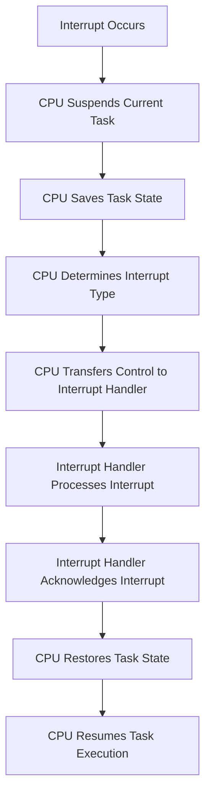

import { Callout, Steps, Step } from "nextra-theme-docs";

# Interrupts and Interrupt Handling

Interrupts and interrupt handling are crucial concepts in operating systems. They allow the OS to respond to events and manage resources efficiently. In this section, we'll explore interrupts and how the operating system handles them.

## What are Interrupts?

Interrupts are signals generated by hardware or software that require immediate attention from the CPU. When an interrupt occurs, the CPU suspends its current task, saves its state, and transfers control to an interrupt handler. The interrupt handler is a special routine designed to deal with the specific interrupt.

Interrupts can be classified into two main categories:

- **Hardware Interrupts**: Generated by hardware devices, such as timers, keyboards, or network cards.
- **Software Interrupts**: Generated by software, such as system calls or exceptions.

<Callout type="info">
Interrupts are essential for enabling the operating system to respond to external events and manage resources effectively.
</Callout>

## Interrupt Handling

Interrupt handling is the process by which the operating system responds to interrupts. When an interrupt occurs, the CPU performs the following steps:

<Steps>
### Step 1

The CPU suspends the currently executing task and saves its state (e.g., register values and program counter).

### Step 2

The CPU determines the type of interrupt and transfers control to the appropriate interrupt handler.

### Step 3

The interrupt handler processes the interrupt, performs any necessary actions, and acknowledges the interrupt.

### Step 4

The CPU restores the saved state of the previously executing task and resumes its execution.
</Steps>

The interrupt handling process is illustrated in the following diagram:

Efficient interrupt handling is crucial for maintaining system responsiveness and performance. The operating system must minimize the time spent in interrupt handlers to avoid delaying other tasks.

To learn more about interrupts and how they work, check out the [Interrupts](/interrupts) subsection. For a detailed look at how the operating system handles interrupts, see the [Interrupt Handling](/interrupt-handling) subsection.

## Examples

Here are a few examples of interrupts and their corresponding handlers:

- **Timer Interrupt**: Generated periodically by the system timer to allow the operating system to perform scheduling and other time-related tasks.
- **Keyboard Interrupt**: Generated when a key is pressed or released, allowing the operating system to process user input.
- **Page Fault Interrupt**: Generated when a program attempts to access a memory page that is not currently in physical memory, prompting the operating system to load the page from disk.

<Callout type="warning">
Improperly handled interrupts can lead to system instability, performance degradation, or even crashes. It's essential to design interrupt handlers carefully and keep them as short and efficient as possible.
</Callout>

By understanding interrupts and interrupt handling, you'll be better equipped to design and develop efficient and responsive operating systems. In the following subsections, we'll dive deeper into [Interrupts](/interrupts) and [Interrupt Handling](/interrupt-handling) to gain a more comprehensive understanding of these critical concepts.