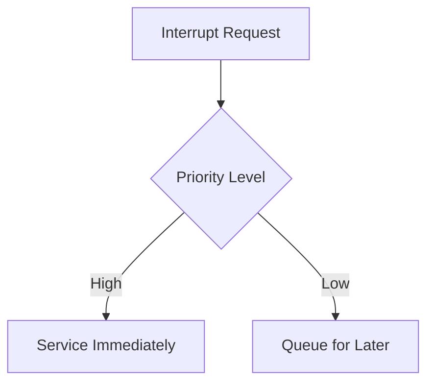

import { Callout, Steps, Step } from "nextra-theme-docs";

# Interrupts

In the world of operating systems, interrupts play a crucial role in enabling the system to respond to external events and manage resources effectively. Interrupts are signals generated by hardware devices or software components that require immediate attention from the CPU. When an interrupt occurs, the CPU temporarily suspends its current task, saves its state, and transfers control to a special routine called an interrupt handler.

## Types of Interrupts

Interrupts can be classified into two main categories:

1. **Hardware Interrupts**: These interrupts are generated by hardware devices, such as keyboards, mice, timers, or network interfaces. They notify the CPU when an event requires immediate processing. For example, when a key is pressed on the keyboard, a hardware interrupt is generated to inform the CPU that input data is available.

2. **Software Interrupts**: Also known as exceptions, software interrupts are generated by software components or the CPU itself. They occur when an exceptional condition is encountered during program execution, such as division by zero, invalid memory access, or a system call. Software interrupts allow the operating system to handle these exceptional situations gracefully.

<Callout type="info">
Hardware interrupts are asynchronous, meaning they can occur at any time, while software interrupts are synchronous and occur as a result of executing specific instructions.
</Callout>

## Interrupt Handling Process

When an interrupt occurs, the operating system follows a specific sequence of steps to handle it:

<Steps>

### Step 1: Interrupt Recognition
The CPU recognizes the interrupt signal and saves its current state, including the program counter and register values, onto the stack.

### Step 2: Interrupt Dispatching
The CPU determines the type of interrupt and invokes the appropriate interrupt handler routine based on the interrupt vector table.

### Step 3: Interrupt Handling
The interrupt handler routine executes, performing the necessary actions to service the interrupt. This may involve reading data from a device, updating system variables, or invoking other system routines.

### Step 4: Interrupt Completion
Once the interrupt handler completes its task, it restores the saved state of the CPU from the stack and returns control to the interrupted program.

</Steps>

## Interrupt Priorities

In a multi-tasking operating system, multiple interrupts may occur simultaneously. To handle such situations, interrupts are assigned priorities. Higher priority interrupts are serviced before lower priority ones. The operating system maintains an interrupt priority level (IPL) that determines which interrupts can be serviced at any given time.

## Interrupt Latency

Interrupt latency refers to the time delay between the occurrence of an interrupt and the start of its handling routine. Minimizing interrupt latency is crucial for real-time systems and applications that require prompt response to external events. Operating systems employ various techniques, such as interrupt masking and interrupt coalescing, to optimize interrupt handling and reduce latency.

## Interrupt Handlers

Interrupt handlers are special routines that are invoked when an interrupt occurs. They are responsible for servicing the interrupt and performing the necessary actions. Interrupt handlers are typically written in low-level languages like assembly or C to ensure fast execution and minimal overhead. They must be carefully designed to avoid conflicts and deadlocks, as they execute in a sensitive context.

## Examples

Here are a few examples of interrupts and their handling in operating systems:

1. **Timer Interrupt**: Operating systems use timer interrupts to keep track of time and schedule tasks. The timer generates periodic interrupts, and the interrupt handler updates system variables, checks for expired timers, and initiates task switching if necessary.

2. **Keyboard Interrupt**: When a key is pressed on the keyboard, a hardware interrupt is generated. The interrupt handler reads the keystroke data from the keyboard buffer and processes it accordingly, such as updating the input buffer or triggering specific actions.

3. **Page Fault Interrupt**: When a program tries to access a memory page that is not currently in physical memory, a page fault interrupt occurs. The interrupt handler initiates the process of bringing the requested page into memory from the backing store (e.g., disk) and resumes the program's execution.

## Conclusion

Interrupts are essential for the smooth operation of an operating system. They allow the system to respond to external events, handle exceptions, and manage resources efficiently. Understanding the types of interrupts, the interrupt handling process, and the role of interrupt handlers is crucial for operating system developers and system-level programmers.

For more information on interrupt handling and related topics, you can refer to the following sections:

- [Interrupt Handling](/interrupts-and-interrupt-handling/interrupt-handling)
- [CPU Features](/cpu-features-and-kernel-architectures/cpu-features)
- [Memory Resources](/memory-resources-and-paging/memory-resources)