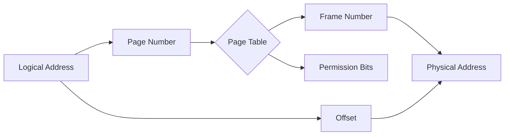

import { Callout, Steps, Step } from "nextra-theme-docs";

# Memory Protection

Memory protection is a crucial aspect of operating systems that ensures the integrity and security of processes running on a system. It prevents unauthorized access to memory regions, safeguarding against malicious or accidental modifications that could lead to system crashes or data corruption.

In this section, we will explore the various mechanisms employed by operating systems to enforce memory protection, including:

- [Segmentation](/memory-protection/segmentation)
- [Permission Bits on Page Table Entries](/memory-protection/permission-bits)

## Segmentation

Segmentation is a memory protection technique used in systems that do not employ paging. It involves dividing process memory into logical pieces called segments, such as the text segment, data segment, stack, and heap.

<Steps>

### Step 1: Divide process memory into segments
Process memory is divided into logical segments at compile time, including:
- Text segment: Contains program code and other read-only data
- Data segment: Stores global variables and allows both reading and writing
- Stack: Holds automatic variables and function call information
- Heap: Manages dynamically allocated data structures

### Step 2: Enforce access permissions on segments
Each segment is assigned specific access permissions, such as read-only or read-write. The operating system maintains a segment table that stores these permissions for each process.

</Steps>

<Callout type="info">
Segmentation helps prevent processes from accessing memory regions that do not belong to them, thus maintaining the integrity of the system.
</Callout>

## Permission Bits on Page Table Entries

In systems that utilize paging, memory protection is implemented as part of the paging system. Page table entries are extended with permission bits that define the access rights for each page.

The most common permission bits include:
- Valid/Invalid bit: Indicates whether a process is allowed to access a particular page
- Read/Write bit: Specifies if a page is read-only or writable

<Callout type="warning">
If a process attempts to access an invalid page or violate the read/write permissions, the CPU raises a fault, which is handled by the operating system. This typically results in the termination of the offending process.
</Callout>

Some modern CPUs, such as AMD and Intel processors, support an additional permission bit called the No-Execute (NX) or Execute-Disable (XD) bit. This bit, when set, prevents the execution of code from memory pages marked as data, providing an extra layer of protection against buffer overflow attacks.

$NX_{bit} = \begin{cases}
1, & \text{if execution is forbidden} \\
0, & \text{if execution is allowed}
\end{cases}$

By leveraging memory protection mechanisms like segmentation and permission bits on page table entries, operating systems ensure that processes operate within their designated memory boundaries, maintaining system stability and security.

For a deeper understanding of how memory protection fits into the broader context of memory management, refer to the [Memory Resources](/memory-resources) and [Paging](/paging) sections.