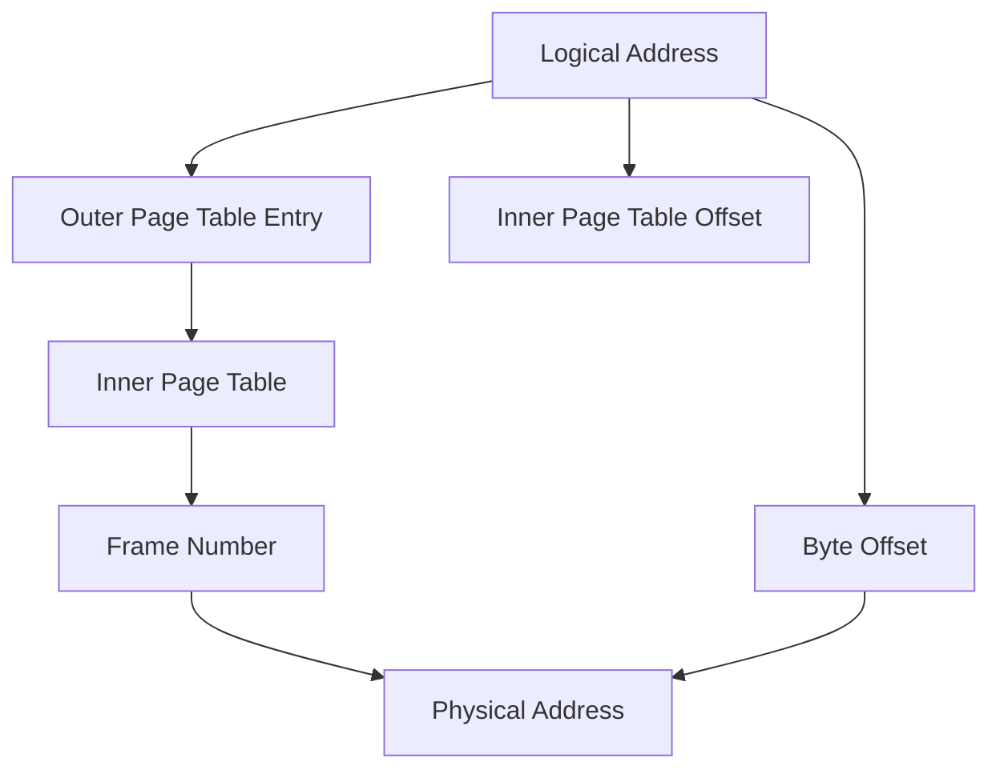

import { Callout, Steps, Step } from "nextra-theme-docs";

# Page Tables

Page tables are data structures that store mappings between logical pages in process memory and physical frames in RAM. These structures are used and managed in different ways on various systems, often with assistance from hardware. In this section, we'll dive into the details of page tables and explore how they support virtual memory management in operating systems.

## Page Table Management

The management of page tables can be handled by either the CPU or the operating system, depending on the architecture:

<Steps>
### Hardware-managed Page Tables

On most modern systems, including x86-64 and ARM CPUs, page tables are managed and searched by the CPU automatically upon a TLB miss. This search increases memory access time but does not require a context switch.

### Software-managed Page Tables

Some CPUs, like the MIPS architecture, require the operating system to manage and search the page table. Whenever a TLB miss occurs, the CPU triggers a fault (a type of interrupt), and the operating system must perform a context switch to execute the interrupt handler for the fault.
</Steps>

<Callout type="info">
Software-managed page tables are becoming increasingly uncommon, even on embedded systems, as popular ARM CPUs now support hardware management.
</Callout>

## Hierarchical Page Tables

To reduce the page table search time during a TLB miss, page tables can be stored as a tree instead of a list. This technique, called hierarchical page tables, divides the page tables into pages, with each logical address in process memory divided into an outer page table, a set of offsets into various levels of subtables, and a final offset to the specific byte of memory to be accessed.

The address translation mechanism with hierarchical page tables involves:
1. Dividing the logical address into an outer page table entry number (T), an offset into the inner page table (P), and a byte offset (D).
2. Using T to locate the proper inner page table in the outer page table.
3. Using P to find the mapping from page number to frame number in the inner page table.
4. Combining the frame number (F) with the byte offset (D) to form the physical address.

## Hashed Page Tables

As system RAM sizes continue to grow and 64-bit architectures support larger address spaces, the size of page tables also increases. To reduce page table storage size and increase search speed, a hash table or dictionary structure can be used to store the outer page table.

The address translation process with hashed page tables involves:
1. Hashing the page number (P) using a hash function.
2. Using the hash value to locate the inner page table in the hash table.
3. Performing a linear search of the inner page table to find the frame number.
4. Joining the frame number (F) with the offset (D) to obtain the hardware address.

<Callout type="info">
Hashed page tables efficiently handle sparse address spaces, where not every 64-bit logical address maps to a physical location in RAM.
</Callout>

## Extended Page Tables

On newer x86-64 systems with virtualization extensions, hardware support exists for extended page tables (EPT), also known as rapid virtualization indexing (RVI) or nested page tables (NPT) on AMD CPUs. EPT adds a level of paging, allowing each virtual machine or guest to manage its own memory efficiently without switching the CPU into hypervisor mode.

The address translation process with EPT involves:
1. The guest OS translating a logical page number (P) to a guest frame number (F).
2. The CPU translating the guest frame number (F) to a host frame number (G) using the EPT table.
3. Combining the host frame number (G) with the original byte offset (D) to generate the physical memory address.

Although the EPT translation process is more complex, it improves virtual machine performance by eliminating the need for context switches to the host OS or hypervisor.

For more information on memory management, see the [Memory Resources](/memory-resources) and [Paging](/paging) sections. To learn about memory protection mechanisms, visit the [Memory Protection](/memory-protection) section.