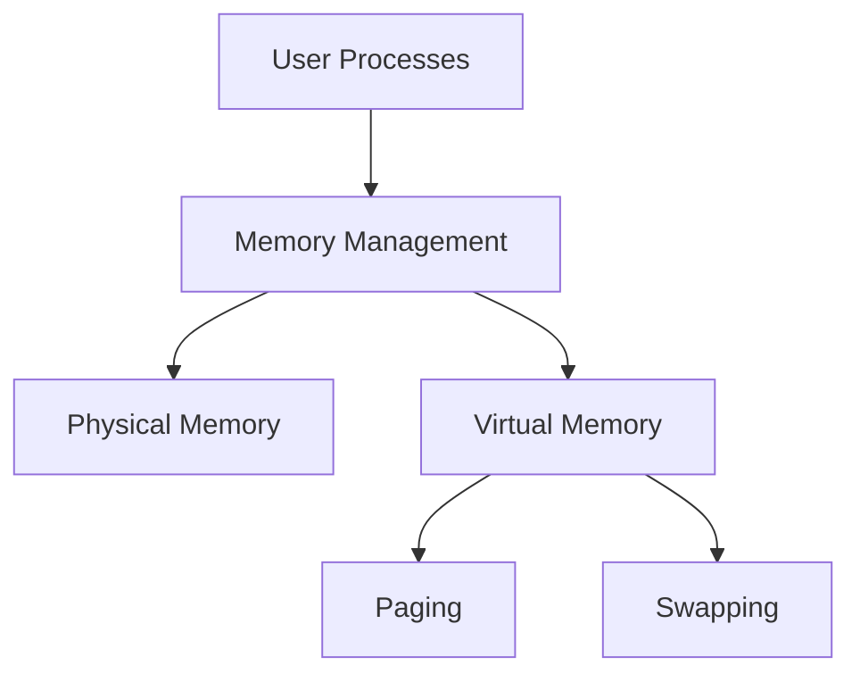

import { Callout, Steps, Step } from "nextra-theme-docs";

# Memory Resources and Paging

In this section, we'll dive into the fascinating world of memory management in operating systems. We'll explore how the OS efficiently handles memory resources and introduce the concept of paging, a powerful technique that allows processes to run seamlessly even when their memory requirements exceed the available physical memory.

## Why Memory Management Matters

Memory is a critical resource in any computing system, and it's the operating system's responsibility to manage it effectively. Without proper memory management, processes would constantly compete for limited memory, leading to slowdowns, crashes, and overall system instability.

<Callout type="info">
  Fun fact: The first operating system to introduce virtual memory and paging was the Atlas Supervisor, developed at the University of Manchester in the late 1950s.
</Callout>

## The Big Picture

Before we delve into the details, let's take a high-level look at how memory management fits into the overall operating system architecture:

As you can see, memory management acts as a bridge between user processes and the physical memory of the system. It's responsible for allocating memory to processes, keeping track of which parts of memory are in use, and deallocating memory when it's no longer needed.

## Memory Resources

To understand how the operating system manages memory, we first need to grasp the key memory resources at its disposal. In the [Memory Resources](/memory-resources-and-paging/memory-resources) subsection, we'll explore the various types of memory, including RAM, cache, and virtual memory, and how they interact with each other.

## Paging

Paging is a memory management scheme that allows processes to run even when their memory requirements exceed the available physical memory. It works by dividing the process's memory into fixed-size chunks called pages, which can be swapped in and out of physical memory as needed. In the [Paging](/memory-resources-and-paging/paging) subsection, we'll dive into the details of how paging works and explore its benefits and challenges.

## Putting It All Together

Now that we've covered the key concepts of memory resources and paging, let's see how they work together in practice:

<Steps>

### Step 1

A process is launched, and the operating system allocates memory for it. The process's memory is divided into pages, which are initially stored in the backing store (usually a hard disk).

### Step 2

As the process runs, it accesses various parts of its memory. Whenever a page that is not currently in physical memory is accessed, a page fault occurs, and the operating system intervenes.

### Step 3

The operating system finds a free page frame in physical memory and loads the requested page from the backing store into that frame. If no free frames are available, the OS may need to swap out a page from another process to make room.

### Step 4

The process continues running, with the operating system transparently managing the movement of pages between physical memory and the backing store as needed.

</Steps>

By leveraging paging and other memory management techniques, the operating system can create the illusion of a large, contiguous memory space for each process, even when the available physical memory is limited. This abstraction is a key enabler of modern computing, allowing us to run complex applications and manipulate vast amounts of data with ease.

<Callout type="success">
  Congratulations! You now have a solid understanding of how memory resources and paging fit into the broader picture of operating system design. In the next sections, we'll build on this foundation and explore more advanced topics, such as [memory protection](/memory-protection-and-page-tables/memory-protection) and [page tables](/memory-protection-and-page-tables/page-tables).
</Callout>