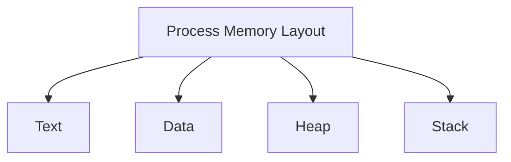

import { Callout, Steps, Step } from "nextra-theme-docs";

# Memory Resources

In a computer system, memory resources play a crucial role in the efficient functioning of the operating system and the execution of processes. The operating system is responsible for managing and allocating memory to various processes, ensuring that each process has access to the memory it needs while preventing conflicts and unauthorized access.

## Types of Memory

There are two main types of memory in a computer system:

1. **Primary Memory (RAM)**: Random Access Memory (RAM) is the main memory where the operating system, application programs, and data in current use are stored. RAM is volatile, meaning that its contents are lost when the power is turned off.

2. **Secondary Memory**: Secondary memory, such as hard disk drives (HDDs) and solid-state drives (SSDs), provides persistent storage for data and programs. Unlike RAM, secondary memory retains its contents even when the power is turned off.

## Memory Hierarchy

The memory resources in a computer system are organized in a hierarchical manner, known as the memory hierarchy. The memory hierarchy consists of several levels, each with different characteristics in terms of speed, capacity, and cost.

<Steps>

### Registers
Registers are the fastest and most expensive memory units, located within the CPU itself. They store data and instructions that are currently being processed by the CPU.

### Cache Memory
Cache memory is a high-speed memory that sits between the CPU and the main memory (RAM). It stores frequently accessed data and instructions to reduce the access time and improve system performance. Cache memory is typically organized in levels (L1, L2, L3) with increasing sizes and decreasing speeds.

### Main Memory (RAM)
Main memory, or RAM, is the primary storage area for active processes and data. It is slower than cache memory but faster than secondary storage devices. The operating system manages the allocation and deallocation of memory to processes.

### Secondary Storage
Secondary storage devices, such as HDDs and SSDs, provide persistent storage for data and programs. They have large capacities but are slower compared to RAM. The operating system manages the transfer of data between main memory and secondary storage.

</Steps>

## Process Memory Layout

Each process in an operating system has its own memory space, which is divided into several sections:

- **Text**: Contains the executable code of the process.
- **Data**: Stores global and static variables.
- **Heap**: Dynamically allocated memory for the process.
- **Stack**: Stores local variables, function parameters, and return addresses.

The operating system maintains a data structure called the [process control block (PCB)](/processes) for each process, which includes information about the process's memory layout and resources.

## Memory Allocation

The operating system is responsible for allocating memory to processes. There are two main approaches to memory allocation:

1. **Contiguous Memory Allocation**: In this approach, the operating system allocates a contiguous block of memory to each process. This simplifies memory management but can lead to fragmentation and inefficient utilization of memory.

2. **Non-Contiguous Memory Allocation**: Modern operating systems use non-contiguous memory allocation techniques, such as [paging](/paging) and segmentation. These techniques allow processes to be allocated memory in non-contiguous blocks, improving memory utilization and reducing fragmentation.

The operating system maintains a data structure called the [page table](/page-tables) to keep track of the mapping between a process's logical memory addresses and the physical memory addresses.

## Memory Protection

To ensure the integrity and security of the system, the operating system implements memory protection mechanisms. Memory protection prevents processes from accessing memory that does not belong to them or is not authorized for their access.

Some common memory protection techniques include:

- **Base and Limit Registers**: Used to define the valid range of memory addresses for a process.
- **Virtual Memory**: Provides each process with its own virtual address space, isolating it from other processes.
- **Access Control**: Assigns different levels of access permissions (read, write, execute) to memory regions.

Memory protection is crucial for maintaining the stability and security of the operating system and preventing unauthorized access or modification of memory by malicious or erroneous processes.

## Conclusion

Memory resources are a critical component of a computer system, and their efficient management is a key responsibility of the operating system. By understanding the memory hierarchy, process memory layout, memory allocation techniques, and memory protection mechanisms, developers and system administrators can optimize the performance and security of their systems.

For more information on related topics, refer to the sections on [paging](/paging), [virtual memory](/virtual-memory), and [memory protection](/memory-protection).