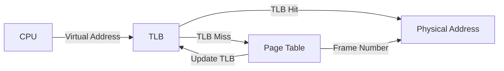

import { Callout, Steps, Step } from "nextra-theme-docs";

# Paging

Paging is a memory management technique used by operating systems to enable processes to utilize more memory than the available physical memory (RAM) on the system. It allows the OS to provide each process with its own virtual address space, which can be larger than the actual physical memory.

## How Paging Works

In a paging system, the virtual address space of a process is divided into fixed-size blocks called **pages**, while the physical memory is divided into equal-sized blocks called **frames**. The mapping between pages and frames is maintained by the operating system using a data structure called a [page table](/memory-protection-and-page-tables/page-tables).

<Steps>
### Step 1: Virtual Address Translation

When a process accesses a memory location using a virtual address, the CPU translates the virtual address into a physical address using the page table.

### Step 2: Page Table Lookup

The page table contains entries that map virtual page numbers to physical frame numbers. The CPU looks up the corresponding frame number in the page table.

### Step 3: Physical Address Generation

If the requested page is present in physical memory (a page hit), the CPU generates the physical address by combining the frame number and the offset within the page.

### Step 4: Page Fault Handling

If the requested page is not present in physical memory (a page fault), the OS invokes the page fault handler to load the required page from the secondary storage (e.g., hard disk) into a free frame in physical memory.
</Steps>

<Callout type="info">
The page table is usually stored in main memory, and its base address is stored in a special CPU register called the **page table base register (PTBR)**.
</Callout>

## Benefits of Paging

1. **Efficient Memory Utilization**: Paging allows processes to use non-contiguous memory, as pages can be scattered throughout physical memory. This reduces external fragmentation and improves memory utilization.

2. **Large Virtual Address Space**: Each process can have a virtual address space larger than the available physical memory, enabling the execution of larger programs.

3. **Protection and Sharing**: Paging facilitates memory protection by allowing the OS to set access rights (read, write, execute) for each page. It also enables sharing of memory between processes by mapping the same physical frame to multiple virtual pages.

## Translation Lookaside Buffer (TLB)

To improve the performance of virtual-to-physical address translation, modern CPUs include a hardware cache called the Translation Lookaside Buffer (TLB). The TLB stores recently used page table entries, allowing the CPU to quickly translate virtual addresses without accessing the page table in memory for every memory reference.

## Page Replacement Algorithms

When a page fault occurs and there are no free frames available in physical memory, the operating system must choose a page to replace. The selected page is then written back to the secondary storage (if modified) and the new page is brought into the freed frame. The algorithm used to make this decision is called a [page replacement algorithm](/object-oriented-implementations-and-page-replacement/page-replacement).

Some common page replacement algorithms include:

- First-In-First-Out (FIFO)
- Least Recently Used (LRU)
- Optimal Page Replacement (OPT)
- Clock Algorithm

<Callout type="info">
The choice of page replacement algorithm can significantly impact the performance of the paging system and the overall system throughput.
</Callout>

## Conclusion

Paging is a crucial component of modern operating systems, enabling efficient memory management and providing processes with virtual address spaces larger than the available physical memory. By understanding the concepts of paging, page tables, and page replacement algorithms, you can better appreciate the inner workings of an operating system and make informed decisions when designing or optimizing memory management subsystems.