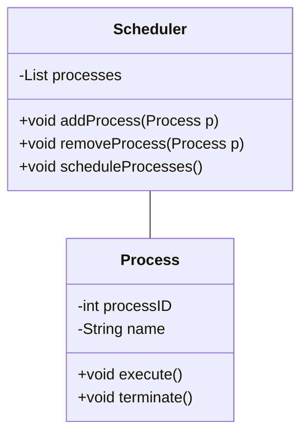

import { Callout, Steps, Step } from "nextra-theme-docs";

# Object-Oriented Implementations and Page Replacement

In this section, we will delve into the fascinating world of object-oriented implementations in operating systems and explore the intricacies of page replacement algorithms. By understanding these concepts, you'll gain valuable insights into how modern operating systems efficiently manage memory and optimize performance.

## Object-Oriented Implementations

Object-oriented design principles have revolutionized the way we develop software, and operating systems are no exception. In this subsection, we'll investigate how object-oriented implementations are applied in the context of operating system development. We'll look at real-world examples and examine the benefits and challenges of adopting an object-oriented approach.

<Callout type="info">
Object-oriented implementations in operating systems provide modularity, extensibility, and code reusability, making the system more maintainable and adaptable to changing requirements.
</Callout>

To fully grasp the impact of object-oriented implementations, it's essential to have a solid understanding of [UML class diagrams](/uml-class-diagrams). These diagrams visually represent the structure and relationships between classes in an object-oriented system.

In the above example, we have a simplified representation of a `Process` class and a `Scheduler` class. The `Scheduler` class maintains a list of processes and provides methods to add, remove, and schedule processes. This demonstrates how object-oriented principles can be applied to model the interactions between different components of an operating system.

## Page Replacement

Page replacement is a crucial aspect of [virtual memory management](/virtual-memory) in operating systems. When the system runs out of available physical memory, it must decide which pages to remove from memory to make room for new pages. This is where page replacement algorithms come into play.

<Steps>
### Step 1: Understanding Page Faults
When a process requests a page that is not currently in physical memory, a page fault occurs. The operating system must then handle the page fault by bringing the requested page into memory.

### Step 2: Selecting a Victim Page
To bring in the requested page, the operating system must choose a page to remove from memory. This page is called the victim page. The selection of the victim page is determined by the page replacement algorithm.

### Step 3: Updating Page Tables
Once the victim page is selected and the new page is brought into memory, the operating system updates the page tables to reflect the changes. The page table entry for the victim page is marked as invalid, and the entry for the new page is updated with its physical memory address.
</Steps>

Some popular page replacement algorithms include:
- **First-In-First-Out (FIFO)**: Replaces the page that has been in memory the longest.
- **Least Recently Used (LRU)**: Replaces the page that has been accessed the least recently.
- **Optimal**: Replaces the page that will not be accessed for the longest time in the future. (Theoretically optimal but not implementable in practice)

The choice of page replacement algorithm can significantly impact the performance of an operating system. Each algorithm has its own trade-offs in terms of implementation complexity and effectiveness in reducing page faults.

<Callout type="warning">
Selecting an inappropriate page replacement algorithm can lead to thrashing, where the system spends more time swapping pages in and out of memory than executing useful work.
</Callout>

By combining object-oriented implementations with efficient page replacement algorithms, operating systems can achieve robust memory management and optimize system performance. Understanding these concepts is essential for anyone involved in operating system development or seeking to build high-performance software systems.