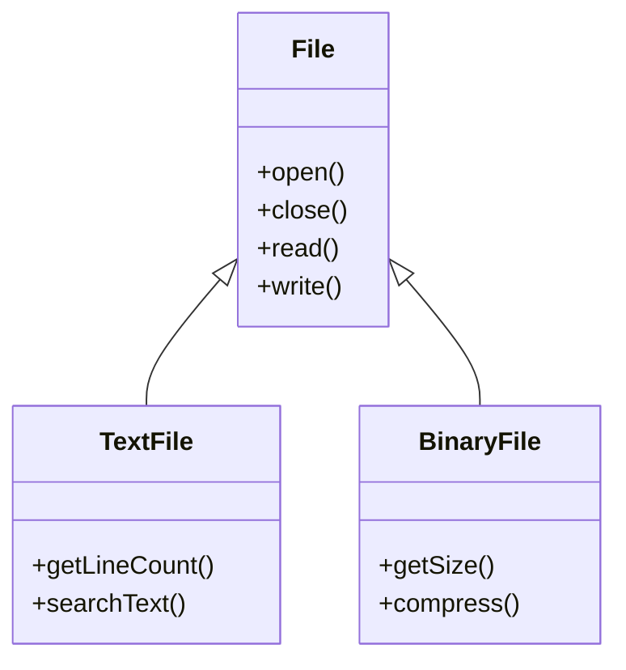

import { Callout, Steps, Step } from "nextra-theme-docs";

# Object-Oriented Implementations

Object-oriented programming (OOP) has become a popular paradigm for designing and implementing operating systems. By leveraging the principles of OOP, such as encapsulation, inheritance, and polymorphism, operating system developers can create modular, maintainable, and extensible code. In this section, we'll explore the various aspects of object-oriented implementations in operating system development.

## Encapsulation

Encapsulation is a fundamental principle of OOP that involves bundling data and methods together within a class. In the context of operating systems, encapsulation helps to hide the internal details of system components and provide a clear interface for interacting with them.

For example, consider a process management system in an operating system. We can define a `Process` class that encapsulates the attributes and behaviors of a process:

```cpp
class Process {
private:
    int processID;
    std::string processName;
    ProcessState state;

public:
    Process(int id, std::string name);
    void setState(ProcessState newState);
    ProcessState getState();
    // Other process-related methods
};
```

In this example, the `Process` class encapsulates the process ID, process name, and process state as private data members. The public methods provide a controlled way to access and modify the process state, hiding the internal details of how the process is represented.

## Inheritance

Inheritance is another key concept in OOP that allows classes to inherit attributes and behaviors from other classes. In operating system development, inheritance can be used to create specialized classes based on a common base class.

Consider a file system implementation where we have a base class called `File` and two derived classes: `TextFile` and `BinaryFile`.



In this example, the `File` class serves as the base class, defining common methods such as `open()`, `close()`, `read()`, and `write()`. The `TextFile` and `BinaryFile` classes inherit from `File` and add specific methods relevant to each file type.

## Polymorphism

Polymorphism allows objects of different classes to be treated as objects of a common base class. This enables the operating system to handle different types of objects in a uniform manner.

Let's consider a device driver system where we have a base class called `Device` and derived classes for specific devices like `Keyboard`, `Mouse`, and `Printer`.

```cpp
class Device {
public:
    virtual void initialize() = 0;
    virtual void handleInterrupt() = 0;
};

class Keyboard : public Device {
public:
    void initialize() override {
        // Keyboard initialization code
    }
    void handleInterrupt() override {
        // Keyboard interrupt handling code
    }
};

class Mouse : public Device {
public:
    void initialize() override {
        // Mouse initialization code
    }
    void handleInterrupt() override {
        // Mouse interrupt handling code
    }
};
```

By defining a common base class `Device` with virtual functions, we can treat objects of `Keyboard` and `Mouse` as `Device` objects. This allows the operating system to manage devices polymorphically, without needing to know the specific device type.

<Callout type="info">
Polymorphism simplifies code maintenance and extensibility. When a new device is added, we can create a new derived class that inherits from the base `Device` class and implements the required virtual functions.
</Callout>

## Real-World Examples

Let's take a look at a few real-world examples of object-oriented implementations in operating systems:

1. **Linux Kernel**: The Linux kernel extensively uses object-oriented concepts, even though it is primarily written in C. Structures and function pointers are used to achieve polymorphism and encapsulation. For example, the `file_operations` structure represents a virtual file system interface, allowing different file systems to provide their own implementations of file-related operations.

2. **Windows NT**: The Windows NT operating system, which forms the basis for modern Windows versions, heavily relies on object-oriented design principles. The kernel mode of Windows NT uses objects to represent various system resources, such as processes, threads, and synchronization primitives. The `EPROCESS` structure represents a process object, encapsulating process-related information and methods.

3. **macOS**: Apple's macOS operating system, based on the XNU kernel, also incorporates object-oriented concepts. The Objective-C programming language, which is heavily used in macOS development, provides object-oriented features like classes, inheritance, and dynamic dispatch. The `IOKit` framework in macOS uses an object-oriented approach to manage device drivers and system services.

## Best Practices

When implementing object-oriented designs in operating system development, consider the following best practices:

<Steps>
### Keep classes focused and cohesive

Define classes that have a clear purpose and encapsulate related data and behavior. Avoid creating overly complex or bloated classes.

### Use inheritance judiciously

Inheritance can be a powerful tool, but overusing it can lead to complex and hard-to-maintain code. Favor composition over inheritance when possible.

### Define clear interfaces

Provide well-defined interfaces for classes and components. Use abstract base classes or interfaces to define common behaviors and enforce contracts.

### Leverage design patterns

Apply relevant design patterns, such as the Observer pattern or the Strategy pattern, to solve common problems and promote code reusability.

### Encapsulate platform-specific details

Hide platform-specific details behind abstractions to enhance portability and maintainability. Use facades or adapters to provide a consistent interface across different platforms.
</Steps>

By following these best practices and leveraging the power of object-oriented programming, operating system developers can create robust, modular, and maintainable systems.

<Callout type="success">
Object-oriented implementations in operating system development offer numerous benefits, including code modularity, reusability, and extensibility. By applying OOP principles and best practices, developers can create efficient and maintainable operating systems.
</Callout>

For more information on related topics, check out the following sections:
- [Virtual Memory](/virtual-memory)
- [Process Management](/process-management)
- [UML Class Diagrams](/uml-class-diagrams)