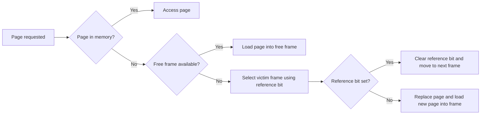

import { Callout, Steps, Step } from "nextra-theme-docs";

# Page Replacement

In [virtual memory](/virtual-memory) systems, the operating system must determine which pages will be kept in memory and which pages will be swapped out to disk when there is a demand for memory that exceeds the actual amount of physical RAM installed on the system. This process of moving page frames back and forth between RAM and the backing store is known as **page replacement**.

## Global vs. Local Page Replacement

Page replacement decisions can be made *globally* or *locally*:

- **Global replacement**: Any page in the system is a potential candidate to be swapped out in favor of another page.
- **Local replacement**: Each process is allocated a limited number of frames. When a process exceeds its frame allocation, only frames belonging to that process are selected for replacement.

<Callout type="info">
Implementing a local page replacement algorithm is more complex than it seems, largely due to Belady's anomaly: allocating more frames to a process does not necessarily reduce the number of page faults that occur as a result of that process.
</Callout>

## Page Table Entries for Page Replacement

To implement page swapping correctly, the operating system needs additional information in the [page table](/memory-protection-and-page-tables/page-tables):

1. **Reference bit**: Indicates whether a page has been referenced by a process.
2. **Dirty bit**: Set to 1 whenever a process writes to a page, indicating that the copy of the memory frame contents on the backing store needs to be updated when the page is swapped out.

<Callout type="info">
On systems with hardware-managed page tables (e.g., x86 and x86-64), the MMU updates the reference and dirty bits automatically.
</Callout>

## Classic Page Replacement Algorithms

Several classic page replacement algorithms exist, each with its own advantages and disadvantages:

### Random

The random algorithm simply picks a victim frame at random whenever a page swap is required. This approach often picks a page that will be needed in the near future, leading to another page fault shortly after.

### Oldest Page

The oldest page algorithm selects the page that has been in memory for the longest period of time. However, this page could be frequently accessed, causing another page fault if it is swapped out.

### Least Frequently Used (LFU)

The LFU algorithm picks the frame that has been accessed the least frequently to be swapped out to the backing store. This approach is ineffective since a page that is used relatively infrequently might still be used regularly.

### Most Frequently Used (MFU)

The MFU algorithm selects the most frequently used frame to be swapped out, which is a completely stupid idea since this page is likely to be accessed again shortly after it is swapped out.

### Least Recently Used (LRU)

The LRU algorithm selects the victim frame that has not been accessed for the longest period of time. This is a good algorithm for choosing victim frames, but it is impractical to implement directly with current hardware due to the lack of a good way to track the last memory access time.

### Optimal (OPT)

Theoretically, the optimal algorithm (OPT) is the best page replacement algorithm. It picks a frame that will not be accessed for the longest period of time as the victim, delaying a future page fault related to the corresponding page for as long as possible. However, OPT is impossible to implement since it must be able to predict all memory accesses ahead of time.

<Steps>

### Step 1: Not Used Recently (NUR)

Most implemented page replacement algorithms are approximations of LRU, such as the Not Used Recently (NUR) algorithm. NUR tracks frame accesses using a combination of the reference bit, dirty bit, and/or an age counter, producing reasonable performance in actual implementations.

### Step 2: Second-Chance Algorithm

Another LRU approximation is the second-chance algorithm, which works as follows:

</Steps>

## Conclusion

Page replacement is a critical component of virtual memory management in operating systems. While several classic algorithms exist, most modern implementations use approximations of the Least Recently Used (LRU) algorithm due to hardware limitations. Effective page replacement algorithms minimize the total number of page faults in the running system, maximizing overall system performance.