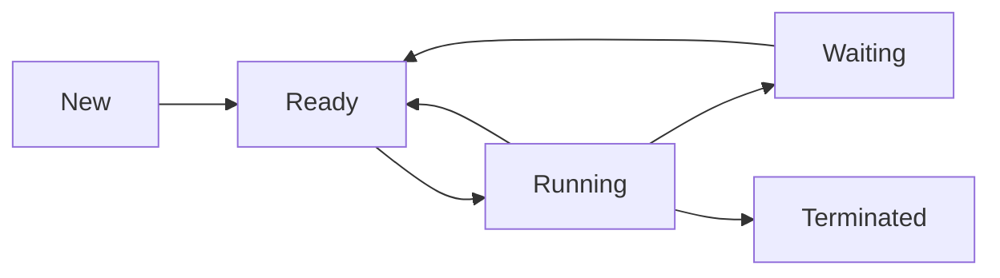

import { Callout, Steps, Step } from "nextra-theme-docs";

# Process Management

Process management is a crucial component of any operating system. It involves the creation, scheduling, and termination of processes, as well as the allocation of system resources to these processes. In this section, we will explore the fundamental concepts of process management and discuss various techniques used by operating systems to manage processes efficiently.

## What is a Process?

A process is an instance of a program in execution. It is a basic unit of work in an operating system. Each process has its own memory space, program counter, and system resources allocated to it. Processes are independent of each other and can run concurrently on a system with multiple processors or cores.

<Callout type="info">
  A process is not the same as a program. A program is a set of instructions that can be executed by a computer, while a process is an instance of a program that is being executed.
</Callout>

## Process States

A process can be in one of several states throughout its lifetime. The most common states are:

- **New**: The process is being created.
- **Ready**: The process is waiting to be assigned to a processor.
- **Running**: The process is being executed by a processor.
- **Waiting**: The process is waiting for some event to occur (such as I/O completion).
- **Terminated**: The process has finished execution.

The following diagram illustrates the transitions between these states:

## Process Control Block (PCB)

The operating system maintains a data structure called a Process Control Block (PCB) for each process. The PCB contains information about the process, such as its state, program counter, CPU registers, memory allocation, and other resources allocated to it.

The PCB is essentially a snapshot of the process at a given point in time. When a process is suspended, its PCB is used to resume its execution later.

## Process Scheduling

Process scheduling is the task of deciding which process should be executed by the CPU at any given time. The operating system uses a scheduler to determine the order in which processes are executed. The scheduler takes into account factors such as process priority, CPU utilization, and system throughput.

There are several scheduling algorithms used by operating systems, including:

- First-Come, First-Served (FCFS)
- Shortest Job Next (SJN)
- Priority Scheduling
- Round Robin (RR)

Each algorithm has its own advantages and disadvantages, and the choice of algorithm depends on the specific requirements of the system.

## Inter-Process Communication (IPC)

Processes often need to communicate with each other to share data or synchronize their activities. The operating system provides various mechanisms for inter-process communication (IPC), such as:

- Pipes
- Message Queues
- Shared Memory
- Sockets

These mechanisms allow processes to exchange data and coordinate their execution.

## Process Synchronization

When multiple processes access shared resources, such as memory or files, it is important to ensure that the resources are accessed in a controlled manner to avoid conflicts and inconsistencies. Process synchronization mechanisms, such as locks, semaphores, and monitors, are used to coordinate access to shared resources and prevent race conditions.

<Callout type="warning">
  Improperly synchronized access to shared resources can lead to race conditions, deadlocks, and other synchronization problems.
</Callout>

## Conclusion

Process management is a fundamental aspect of operating systems. It involves the creation, scheduling, and termination of processes, as well as the allocation of system resources to these processes. The operating system uses various data structures, such as the Process Control Block, and algorithms, such as scheduling algorithms, to manage processes efficiently.

In the following subsections, we will delve deeper into the concepts of [processes](/process-management/processes) and [process management techniques](/process-management/process-management-techniques) used by operating systems.