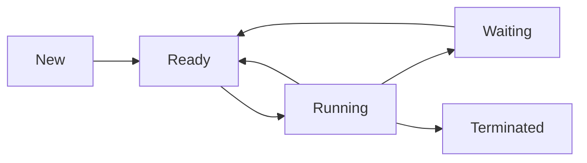

import { Callout, Steps, Step } from "nextra-theme-docs";

# Processes

In this section, we'll dive into the concept of processes in operating systems. Processes are essential components of any modern operating system, as they represent running programs or instances of executing code. Let's explore what processes are, how they're created, and the different states they can be in.

## What is a Process?

A process is an instance of a program in execution. When you run a program on your computer, the operating system creates a new process for that program. Each process has its own memory space, resources, and state information associated with it.

<Callout type="info">
Fun fact: On Unix-like systems, the first process created by the kernel at boot time is called "init" (or "launchd" on macOS). Every other process is a descendant of this initial process.
</Callout>

## Process Creation

On Unix-like systems, processes are created through a mechanism called *forking*. When a process wants to create a new process, it calls the `fork()` system call. The `fork()` system call creates an exact copy of the calling process, known as the child process. The original process becomes the parent process.

<Steps>
### Step 1: Parent Process Calls `fork()`

The parent process invokes the `fork()` system call to initiate the creation of a new child process.

### Step 2: Operating System Creates Child Process

The operating system creates an exact copy of the parent process, including its memory space, open file descriptors, and other resources. The child process is assigned a new unique process ID (PID).

### Step 3: Execution Continues in Both Processes

After the `fork()` call, both the parent and child processes continue execution from the point where `fork()` was called. The return value of `fork()` allows the processes to determine their roles (parent or child).
</Steps>

Here's a simple example of process creation using `fork()` in C:

```c
#include <stdio.h>
#include <unistd.h>

int main() {
    pid_t pid = fork();

    if (pid < 0) {
        // Fork failed
        fprintf(stderr, "Fork failed");
        return 1;
    } else if (pid == 0) {
        // Child process
        printf("I am the child process (PID: %d)\n", getpid());
    } else {
        // Parent process
        printf("I am the parent process (PID: %d)\n", getpid());
    }

    return 0;
}
```

## Process States

Throughout its lifetime, a process goes through different states. The main states of a process are:

1. **New**: When a process is first created, it starts in the "new" state. The operating system allocates necessary resources for the process.

2. **Ready**: Once the process is created and ready to run, it transitions to the "ready" state. The process is loaded into memory and waiting to be scheduled on a CPU core.

3. **Running**: When the scheduler selects a process from the ready queue and allocates a CPU core to it, the process moves to the "running" state. The process is actively executing its instructions.

4. **Waiting**: If a process is waiting for an event to occur, such as I/O completion or a signal from another process, it enters the "waiting" state. The process is temporarily suspended until the awaited event occurs.

5. **Terminated**: When a process finishes its execution or is explicitly terminated, it moves to the "terminated" state. The operating system performs cleanup, releases resources, and removes the process from the system.

The following diagram illustrates the transitions between process states:



Understanding process states is crucial for effective process management and scheduling in operating systems. The operating system maintains data structures, such as [process control blocks](/process-management-techniques#process-control-blocks-pcbs), to keep track of each process's state and related information.

In the next section, we'll explore [process management techniques](/process-management-techniques) used by operating systems to efficiently manage and schedule processes, ensuring fair resource allocation and optimal system performance.