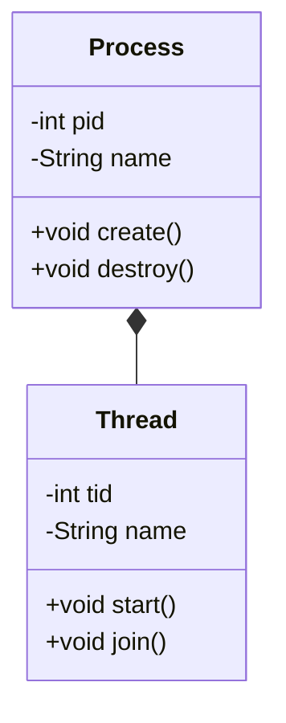

import { Callout, Steps, Step } from "nextra-theme-docs";

# Test-Driven Design and UML Class Diagrams

Test-driven design (TDD) and Unified Modeling Language (UML) class diagrams are two essential tools in the development of operating systems. TDD is a software development approach that emphasizes writing tests before writing the actual code, while UML class diagrams provide a visual representation of the system's object-oriented design.

In this section, we will explore the principles and practices of test-driven design in operating system development and understand how UML class diagrams can be applied to design operating systems effectively.

## Why Test-Driven Design Matters in Operating System Development

Test-driven design is crucial in operating system development for several reasons:

1. **Ensuring system stability**: Operating systems are the foundation upon which all other software runs. By writing tests first, developers can ensure that the system remains stable and reliable as new features are added or modifications are made.

2. **Catching bugs early**: TDD helps catch bugs and issues early in the development process, reducing the cost and effort required to fix them later.

3. **Improving code quality**: By focusing on writing tests first, developers are forced to think about the desired behavior of the system and design code that is modular, reusable, and maintainable.

<Callout type="info">
Test-driven design is not only beneficial for operating system development but also for any large-scale software project where reliability and maintainability are crucial.
</Callout>

## Applying UML Class Diagrams in Operating System Design

UML class diagrams are a powerful tool for designing the object-oriented structure of an operating system. They help developers visualize the relationships between different components of the system and ensure that the design is modular and extensible.

Here are some key benefits of using UML class diagrams in operating system design:

1. **Identifying object-oriented structure**: Class diagrams help identify the main objects in the system, their attributes, and the operations they perform.

2. **Defining relationships**: Class diagrams allow developers to define the relationships between objects, such as inheritance, association, and composition.

3. **Facilitating communication**: UML class diagrams serve as a common language for developers, making it easier to communicate and collaborate on the design of the operating system.

<Steps>

### Step 1: Identify the main objects in the operating system

Begin by identifying the main objects in the operating system, such as processes, threads, memory managers, and device drivers.

### Step 2: Define the attributes and operations of each object

For each object identified in step 1, define its attributes (data) and operations (methods). This will help you understand the responsibilities of each object and how they interact with each other.

### Step 3: Determine the relationships between objects

Identify the relationships between the objects, such as inheritance (e.g., a thread inheriting from a process), association (e.g., a process being associated with a memory manager), and composition (e.g., a device driver being composed of multiple sub-components).

### Step 4: Create the UML class diagram

Using the information gathered in the previous steps, create the UML class diagram to visually represent the object-oriented design of the operating system. You can use tools like [Mermaid](https://mermaid-js.github.io/mermaid/#/) to create diagrams directly in your markdown documentation.

</Steps>

For example, here's a simple UML class diagram for a process and thread relationship using Mermaid:

By combining test-driven design and UML class diagrams, operating system developers can create systems that are reliable, maintainable, and well-designed. To learn more about these topics, check out the subsections on [Test-Driven Design](/test-driven-design-and-uml-class-diagrams/test-driven-design) and [UML Class Diagrams](/test-driven-design-and-uml-class-diagrams/uml-class-diagrams).