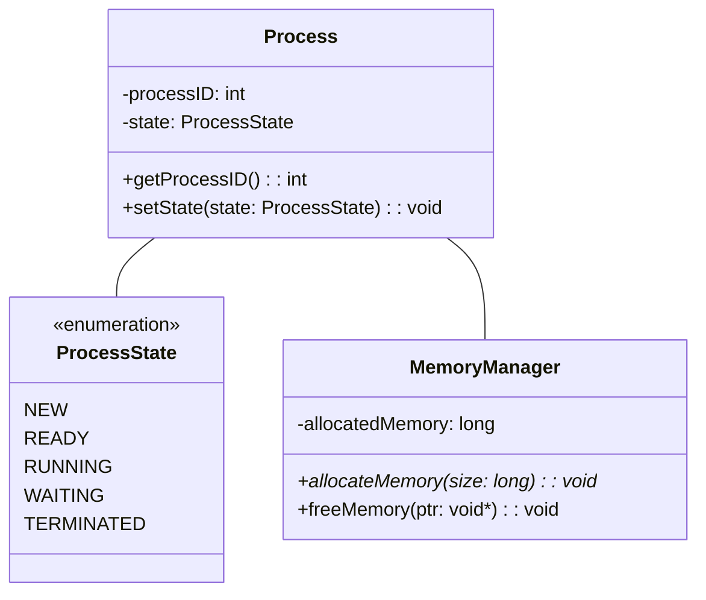

import { Callout, Steps, Step } from "nextra-theme-docs";

# UML Class Diagrams

UML class diagrams provide a graphical representation of the static structure of an object-oriented system, including the classes, their attributes, operations (or methods), and the relationships among objects. In the context of operating systems, class diagrams can be used to model the various components and their interactions.

## Basic Elements of a Class Diagram

A class diagram consists of three main elements:

1. **Classes**: Represented by rectangles divided into three compartments:
   - Class name
   - Attributes
   - Operations (methods)

2. **Relationships**: Represented by lines connecting the classes. The most common relationships are:
   - Association
   - Aggregation
   - Composition
   - Inheritance

3. **Multiplicity**: Indicates the number of instances of one class linked to one instance of another class. It is represented by a number or a range of numbers near the end of an association line.

<Callout type="info">
Visibility of attributes and operations is denoted by prefixing the name with a symbol:

- `+` Public
- `-` Private
- `#` Protected
- `~` Package/Internal
</Callout>

## Example: Simple Operating System Class Diagram

Let's consider a simplified example of an operating system class diagram focusing on process management and memory management.

In this example:

- The `Process` class represents a process in the operating system, with attributes like `processID` and `state`, and methods to access and modify these attributes.
- The `ProcessState` enumeration defines the possible states a process can be in.
- The `MemoryManager` class is responsible for managing memory allocation and deallocation.
- The relationships between the classes are represented by lines. The `Process` class is associated with both the `ProcessState` and `MemoryManager` classes.

## Relationships in Class Diagrams

### Association

Association represents a general relationship between two classes, indicating that one class uses or interacts with another. In the example above, the `Process` class is associated with the `MemoryManager` class, indicating that a process interacts with the memory manager for memory allocation and deallocation.

### Aggregation and Composition

Aggregation and composition are special types of associations that represent "part-of" relationships. Aggregation is a weaker "part-of" relationship, while composition is a stronger one.

- Aggregation: Represented by an open diamond at the end of the association line near the class that represents the whole. It indicates that one class is a part of another class, but the part can exist independently of the whole.

- Composition: Represented by a filled diamond at the end of the association line near the class that represents the whole. It indicates that one class is a part of another class, and the part cannot exist independently of the whole.

<Steps>

### Step 1: Identify the classes
Before creating a class diagram, identify the main classes in your operating system. These could include `Process`, `Thread`, `MemoryManager`, `FileSystem`, etc.

### Step 2: Define attributes and operations
For each class, define its attributes (data members) and operations (methods). Determine the visibility (public, private, protected) of each attribute and operation.

### Step 3: Establish relationships
Identify the relationships between the classes. Determine if there are any associations, aggregations, or compositions among the classes.

### Step 4: Add multiplicity
Specify the multiplicity of each relationship, indicating how many instances of one class are related to instances of another class.

### Step 5: Refine and iterate
Review your class diagram and refine it as needed. Iterate on the design until it accurately represents your operating system's structure.
</Steps>

For more information on [UML Activity Diagrams](/uml-activity-diagrams), [Kernel Architectures](/kernel-architectures), and [Object-Oriented Design](/object-oriented-design) in operating systems, please refer to their respective sections.