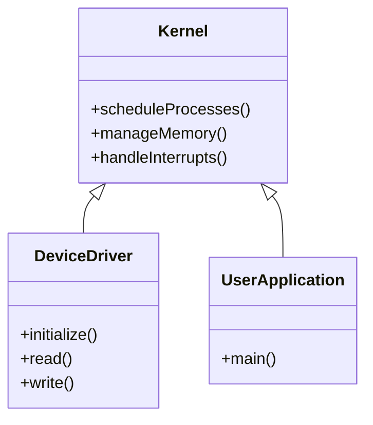

import { Callout, Steps, Step } from "nextra-theme-docs";

# UML and Use Cases

In this section, we'll dive into the world of Unified Modeling Language (UML) and use cases, and explore how they apply to the design and development of operating systems. UML is a powerful tool that allows developers to visually represent the structure, behavior, and interactions of a system, while use cases help define the functional requirements and goals of the system from the perspective of the end-user.

## Why UML and Use Cases Matter

When it comes to designing and building complex systems like operating systems, having a clear and concise way to communicate ideas and requirements is essential. This is where UML and use cases come into play.

<Callout type="info">
UML provides a standardized set of diagrams and notations that allow developers to model various aspects of a system, such as its architecture, components, and interactions. By using UML, teams can collaborate more effectively, reduce ambiguity, and ensure that everyone is on the same page.
</Callout>

Use cases, on the other hand, focus on capturing the functional requirements of a system from the perspective of the end-user. They describe the goals and objectives that the system must fulfill, and the steps required to achieve those goals. By defining use cases, developers can ensure that the system meets the needs of its intended audience and delivers value to its users.

## Types of UML Diagrams

UML offers a wide range of diagrams that can be used to model different aspects of a system. Some of the most commonly used diagrams in the context of operating systems include:

- [Class Diagrams](/uml-class-diagrams): These diagrams represent the static structure of a system, showing the classes, their attributes, and the relationships between them.

- [Sequence Diagrams](/uml-state-diagrams): These diagrams show the dynamic behavior of a system, focusing on the interactions between objects over time.

- [Activity Diagrams](/uml-activity-diagrams): These diagrams represent the flow of control and data within a system, showing the steps and decisions involved in a particular process.

- [State Machine Diagrams](/uml-state-diagrams): These diagrams describe the behavior of a system in terms of states and transitions, showing how the system responds to events and changes over time.

## Applying UML and Use Cases to Operating Systems

When it comes to designing and developing operating systems, UML and use cases can be invaluable tools. Here are a few examples of how they can be applied:

<Steps>

### Modeling System Architecture

UML class diagrams can be used to model the overall architecture of an operating system, showing the key components and their relationships. For example, a class diagram might represent the kernel, device drivers, and user-space applications as separate classes, with arrows indicating the dependencies between them.

### Defining User Interactions

Use cases can be employed to capture the key interactions between users and the operating system. For instance, a use case might describe the steps involved in launching an application, saving a file, or adjusting system settings.

### Modeling Process Flows

UML activity diagrams can be used to model the flow of control within specific operating system processes, such as [process scheduling](/process-management/process-management-techniques), [memory allocation](/memory-resources-and-paging/memory-resources), or [interrupt handling](/interrupts-and-interrupt-handling/interrupt-handling). These diagrams can help developers understand the sequence of steps and decisions involved in each process, and identify potential bottlenecks or areas for optimization.

</Steps>

By leveraging the power of UML and use cases, operating system developers can create more robust, efficient, and user-friendly systems that meet the needs of their target audience. In the following subsections, we'll explore [UML activity diagrams](/uml-activity-diagrams) and [use cases](/use-cases) in more detail, and provide practical examples of how they can be applied in the context of operating system design and development.