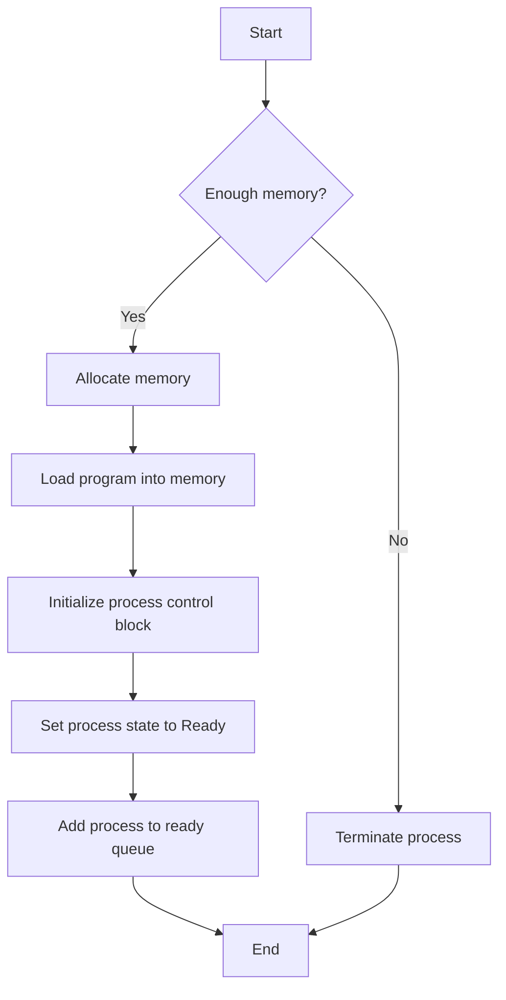

import { Callout, Steps, Step } from "nextra-theme-docs";

# UML Activity Diagrams

UML activity diagrams are a powerful tool for modeling processes in software systems, including operating systems. They provide a visual representation of the flow of activities, decisions, and concurrency within a process.

## Key Components of UML Activity Diagrams

UML activity diagrams consist of several key components:

- **Initial Node**: Represented by a filled circle, it marks the starting point of the activity diagram.
- **Final Node**: Depicted as a filled circle within another circle, it indicates the end of the activity flow.
- **Action Node**: Represented by a rounded rectangle, it denotes a single step or action in the process.
- **Decision Node**: Shown as a diamond shape, it represents a decision point where the flow can branch based on a condition.
- **Merge Node**: Also represented by a diamond shape, it brings multiple flows back together.
- **Fork Node**: Depicted as a thick horizontal or vertical line, it splits the flow into multiple concurrent paths.
- **Join Node**: Also shown as a thick line, it synchronizes multiple concurrent flows back into a single path.

<Callout type="info">
UML activity diagrams can be used to model various processes within an operating system, such as [process management](/process-management), [interrupt handling](/interrupts-and-interrupt-handling), and [memory management](/memory-resources-and-paging).
</Callout>

## Creating UML Activity Diagrams

To create a UML activity diagram, follow these steps:

<Steps>
### Step 1: Identify the process

Determine the specific process or workflow you want to model within the operating system. This could be a high-level process or a more detailed subprocess.

### Step 2: Define the starting point

Identify the initial node where the process begins. This is typically triggered by an event or a specific condition.

### Step 3: Determine the actions and decisions

Break down the process into individual actions and decision points. Each action represents a step in the process, while decisions represent points where the flow can branch based on certain conditions.

### Step 4: Add concurrency if needed

If the process involves concurrent activities, use fork and join nodes to represent the splitting and merging of the flow. Concurrent activities can be modeled as parallel paths in the diagram.

### Step 5: Connect the nodes

Use arrows to connect the nodes in the diagram, representing the flow of activities. Ensure that the flow is logical and follows the intended sequence of actions.

### Step 6: Identify the end point

Determine the final node where the process ends. This could be a single endpoint or multiple endpoints depending on the process.
</Steps>

## Example: Process Creation in an Operating System

Let's consider an example of modeling the process creation workflow in an operating system using a UML activity diagram.

In this diagram:
- The initial node represents the start of the process creation workflow.
- The decision node checks if there is enough memory available for the new process.
- If there is sufficient memory, the action nodes allocate memory, load the program into memory, initialize the process control block, set the process state to ready, and add the process to the ready queue.
- If there is insufficient memory, the process is terminated.
- The final node represents the end of the process creation workflow.

By using UML activity diagrams, you can visually represent complex processes within an operating system, making it easier to understand, analyze, and communicate the workflow to others.

<Callout type="info">
UML activity diagrams can be further enhanced with [use cases](/uml-and-use-cases/use-cases) to provide a more comprehensive view of the system's behavior and interactions.
</Callout>

## Conclusion

UML activity diagrams are a valuable tool for modeling and visualizing processes in operating systems. They help in understanding the flow of activities, decision points, and concurrency within a process. By following the steps outlined above and referring to the provided example, you can create effective UML activity diagrams to represent various processes in your operating system design.