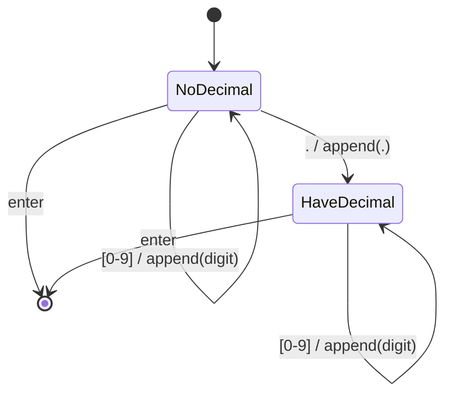

import { Callout, Steps, Step } from "nextra-theme-docs";

# UML State Diagrams

UML state diagrams provide a graphical way to model the behavior of a system by analyzing how the state of the system changes in response to input data. In the context of operating systems, state diagrams can be used to model various components, such as process management, memory management, and device drivers.

## Basic Components of a UML State Diagram

A UML state diagram consists of the following basic components:

- **Initial State**: Represented by a filled circle, this is the entry point of the diagram.
- **Final State**: Represented by a filled circle within another circle, this is the exit point of the diagram.
- **States**: Depicted as rounded rectangles, states represent the different conditions or modes of the system.
- **Transitions**: Shown as arrows connecting states, transitions indicate the movement from one state to another based on specific triggers or conditions.

Here's a simple example of a UML state diagram that captures the user entering a number consisting of digits 0 through 9 and at most one decimal point:

In this example, the system starts in the "NoDecimal" state. It transitions to the "HaveDecimal" state upon receiving a period (.) as input, and it remains in either state as long as digits (0-9) are received. Pressing the enter key ends the machine by moving to the final state.

## Applying UML State Diagrams to Operating Systems

UML state diagrams can be used to model various aspects of an operating system, such as:

- [Process states](/processes): Running, Ready, Waiting, Terminated
- [Memory allocation](/memory-resources): Free, Allocated, Paged Out
- [Device drivers](/hardware-resources): Idle, Busy, Error

<Callout type="info">
By modeling these components using state diagrams, operating system developers can better understand and visualize the behavior of the system, leading to more efficient and robust implementations.
</Callout>

## Nested State Diagrams

UML allows states within a state diagram to contain another state diagram, known as nested state diagrams. While this feature can be useful for modeling complex behaviors, it can quickly make the diagrams difficult to read and maintain.

<Steps>

### Step 1: Identify Complex States
Review your state diagram and identify any states that could benefit from being modeled as a separate, nested state diagram.

### Step 2: Create a New State Diagram
For each complex state identified in Step 1, create a new state diagram that models the behavior within that state.

### Step 3: Replace Complex States with Nested Diagrams
In the original state diagram, replace the complex states with a special symbol consisting of two empty states joined together, indicating that the state is modeled by another state diagram.

</Steps>

By following these steps, you can create a more modular and maintainable set of state diagrams for your operating system components.

For more information on related topics, check out the sections on [UML Activity Diagrams](/uml-activity-diagrams) and [Object-Oriented Design](/object-oriented-design).