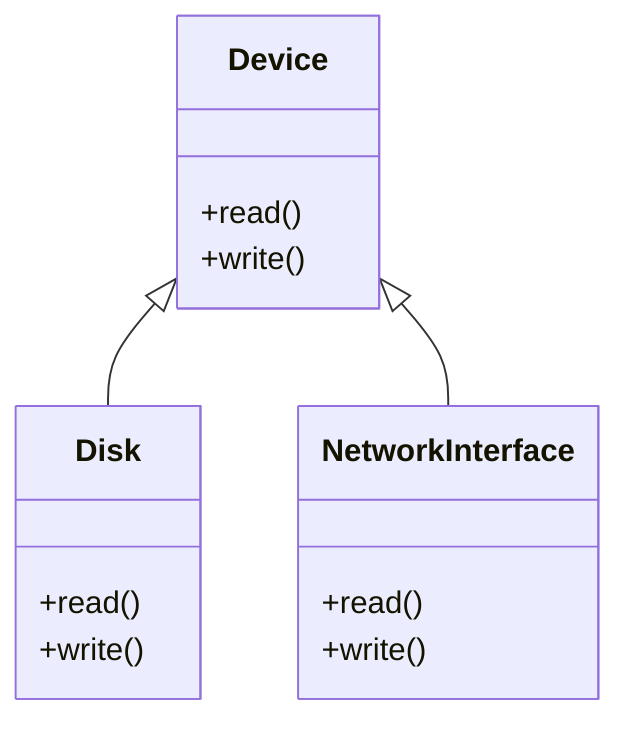

import { Callout, Steps, Step } from "nextra-theme-docs";

# Object-Oriented Design

Object-oriented design (OOD) is a crucial aspect of modern operating system development. It focuses on organizing the system as a collection of interacting objects, each with its own set of attributes and behaviors. By applying the principles of encapsulation, inheritance, and polymorphism, OOD enables developers to create modular, reusable, and maintainable code.

## Encapsulation

Encapsulation is a fundamental concept in OOD that involves bundling data and methods that operate on that data within a single unit, known as a class. By encapsulating data and methods, the internal state of an object is protected from direct access by other parts of the program. This promotes data integrity and reduces dependencies between components.

<Callout>
Encapsulation helps in achieving a higher level of abstraction, making the code more readable and easier to understand.
</Callout>

## Inheritance

Inheritance is a mechanism that allows new classes to be based on existing classes, inheriting their attributes and behaviors. This promotes code reuse and helps in creating a hierarchical structure of classes. In the context of operating systems, inheritance can be used to define common properties and methods for various system components, such as processes, threads, and memory management units.

$\text{Derived Class} \leftarrow \text{Base Class}$

## Polymorphism

Polymorphism allows objects of different classes to be treated as objects of a common parent class. This enables developers to write generic code that can work with objects of multiple types, promoting flexibility and extensibility. In operating systems, polymorphism can be applied to handle different types of devices, file systems, or scheduling algorithms through a common interface.

## Designing with Objects

When designing an operating system using OOD, it is essential to identify the key objects and their relationships. This involves:

<Steps>

### Step 1

Identifying the main components of the system, such as processes, threads, memory management, file systems, and device drivers.

### Step 2

Defining the attributes and behaviors of each component, encapsulating them into classes.

### Step 3

Establishing relationships between classes, such as inheritance and composition, to create a cohesive and modular design.

</Steps>

By following these steps, developers can create an operating system that is easier to understand, maintain, and extend.

## Benefits of OOD in Operating Systems

Applying object-oriented design principles to operating system development offers several benefits:

- Modularity: OOD promotes a modular design, making the system easier to understand, debug, and maintain.
- Reusability: Classes can be reused across different parts of the system, reducing code duplication and development time.
- Extensibility: New features can be added to the system by creating new classes or extending existing ones, without modifying the core components.
- Abstraction: OOD allows developers to focus on the essential features of the system, hiding the complexities of low-level implementation details.

To learn more about related concepts, explore the following sections:

- [UML Class Diagrams](/uml-class-diagrams) for visualizing object-oriented designs
- [Object-Oriented Implementations](/object-oriented-implementations) for putting OOD principles into practice
- [Virtual Memory](/virtual-memory) for understanding how OOD can be applied to memory management

By mastering object-oriented design principles, operating system developers can create robust, maintainable, and extensible systems that meet the ever-growing demands of modern computing.