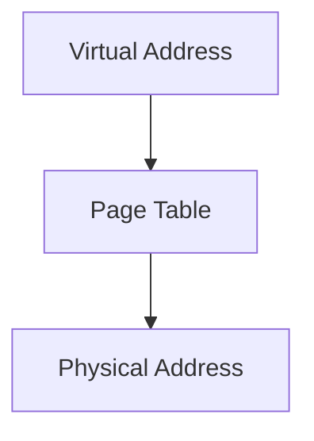

import { Callout, Steps, Step } from "nextra-theme-docs";

# Virtual Memory

Virtual memory is a critical component of modern operating systems that enables efficient memory management and allows multiple processes to share the same physical memory. It provides an abstraction layer between the logical memory addresses used by processes and the physical memory addresses used by the hardware.

## How Virtual Memory Works

The concept of virtual memory is based on the idea of **paging**. The operating system divides the physical memory into fixed-size blocks called **frames** and divides the logical memory used by processes into blocks of the same size called **pages**. The mapping between logical pages and physical frames is maintained by the operating system using a data structure called the [page table](/memory-protection-and-page-tables/page-tables).

<Callout type="info">
The size of a page or frame is typically 4 KB, although some systems support larger page sizes, such as 2 MB or 4 MB, known as huge pages.
</Callout>

When a process accesses a memory location, the CPU translates the logical address to a physical address using the page table. If the requested page is not currently in physical memory (a situation known as a **page fault**), the operating system transparently loads the page from the backing store (usually a hard disk) into an available frame in physical memory.

The process of translating logical addresses to physical addresses is performed by a hardware component called the **Memory Management Unit (MMU)**. The MMU maintains a cache of recently used page table entries called the **Translation Lookaside Buffer (TLB)** to speed up address translation.

## Benefits of Virtual Memory

Virtual memory provides several benefits to the operating system and processes:

1. **Increased Multiprogramming**: Virtual memory allows the operating system to load more processes into memory than would otherwise be possible, as each process only needs to load a subset of its pages into physical memory at any given time.

2. **Isolation and Protection**: Each process operates in its own virtual address space, which is isolated from other processes. This prevents processes from accessing or modifying each other's memory, enhancing system stability and security.

3. **Efficient Memory Utilization**: Virtual memory enables the operating system to allocate memory to processes on-demand, reducing memory waste. Additionally, the operating system can swap out unused pages to the backing store, freeing up physical memory for other processes.

4. **Simplified Memory Management**: Virtual memory provides a consistent and contiguous view of memory to processes, simplifying memory management for developers. Processes can allocate and access memory without worrying about the underlying physical memory layout.

## Example: Virtual Memory in Linux

In Linux, virtual memory is implemented using a combination of hardware and software components. The Linux kernel maintains a page table for each process, which maps virtual addresses to physical addresses. The page table is a hierarchical data structure that consists of multiple levels, allowing efficient translation of large address spaces.

When a process accesses a virtual memory address, the MMU traverses the page table to find the corresponding physical address. If the requested page is not present in physical memory, the MMU generates a page fault, which is handled by the kernel's page fault handler. The page fault handler loads the requested page from the backing store into an available frame in physical memory and updates the page table accordingly.

Linux also supports various page replacement algorithms, such as Least Recently Used (LRU) and Second Chance, to determine which pages to evict from physical memory when necessary. These algorithms aim to minimize the number of page faults and optimize memory utilization.

<Steps>
### Step 1: Process Accesses Virtual Address
A process accesses a virtual memory address, which is divided into a page number and an offset within the page.

### Step 2: MMU Translates Virtual Address
The MMU uses the page number to index into the process's page table and retrieve the corresponding physical frame number.

### Step 3: Page Fault Handling (if necessary)
If the requested page is not present in physical memory, the MMU generates a page fault. The kernel's page fault handler loads the page from the backing store into an available frame and updates the page table.

### Step 4: Physical Address Access
The MMU combines the physical frame number with the offset to form the physical address, which is used to access the desired memory location.
</Steps>

By leveraging virtual memory, Linux provides a robust and efficient memory management system that enables multiple processes to coexist and share limited physical memory resources.

For more information on memory management in operating systems, refer to the following sections:
- [Memory Resources](/memory-resources-and-paging/memory-resources)
- [Paging](/memory-resources-and-paging/paging)
- [Memory Protection](/memory-protection-and-page-tables/memory-protection)
- [Page Tables](/memory-protection-and-page-tables/page-tables)